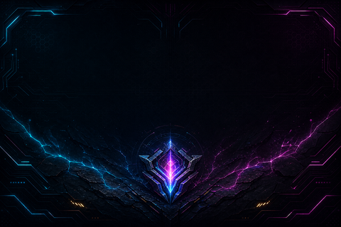

# TelemetryForge

An open-source Windows desktop application for TURZX/Turing Smart Screen
3.5-inch USB displays normally controlled by `UsbMonitor.exe`.

## Highlights

- Visual drag-and-drop screen editor with live preview
- Reusable YAML screen profiles
- CPU, GPU, RAM, VRAM, disk, network, fan, Windows volume and clock sensors
- Text, bars, circular gauges and historical graphs
- Per-widget fonts, gradients, opacity, glow, shadows and thresholds
- Multi-select, group movement, alignment and distribution
- Smooth animations and partial display updates
- Assignable Gaming, Minimal and Idle quick screens
- Automatic screen rules and configurable screen transitions
- English and Italian user interfaces
- System tray and Windows autostart

## Supported hardware

The current driver targets Turing/UsbMonitor revision A displays, including
devices identified as `USB35INCHIPSV2` or USB VID/PID `1a86:5722`.

- Serial speed: 115200 baud
- Flow control: hardware RTS/CTS
- Pixel format: RGB565 little-endian
- Typical resolutions: 480×320 landscape or 320×480 portrait

Always close `UsbMonitor.exe` before starting TelemetryForge.

## Requirements

1. Windows 10 or Windows 11
2. Microsoft Edge WebView2 Runtime
3. Rust stable with the recommended MSVC toolchain
4. The display serial driver, commonly CH340 or CH552
5. Optional: LibreHardwareMonitor or FanControl

```powershell
rustup default stable-x86_64-pc-windows-msvc
```

Node.js is not required.

## Development

```powershell
cargo run
```

Application data is stored in:

```text
%LOCALAPPDATA%\TelemetryForge
```

This includes `config.yaml`, saved screens and bundled samples. Legacy data
found next to the executable is migrated automatically. Windows autostart
loads the last active configuration and starts rendering in the system tray.
It uses an immediate Task Scheduler logon trigger instead of the delayed
`HKCU\Run` startup queue.

## Release build

```powershell
cargo build --release
```

The executable is written to `target\release\TelemetryForge.exe`.

Every push to `main` publishes a numbered Windows build such as
`v0.2.0-build.17` and marks it as the GitHub Latest release. Stable milestones
continue to use semantic tags such as `v0.3.0`.

To create a Tauri installer:

```powershell
cargo install tauri-cli --version "^2"
cargo tauri build
```

## LibreHardwareMonitor

TelemetryForge automatically checks common LibreHardwareMonitor and FanControl
installation folders. You can also set an explicit DLL path:

```yaml
libre_hardware_monitor_dll: 'C:\Tools\LibreHardwareMonitor\LibreHardwareMonitorLib.dll'
```

The bridge runs through `scripts\read-lhm.ps1` in a hidden PowerShell process.
Some sensors may require administrator privileges.

## Screen editor

Screens are stored as YAML files inside the `screens` directory. Widgets can
be dragged, resized, multi-selected, aligned and evenly distributed.

The interface is split into **Editor** and **Setup** workspaces. Display,
Remote Deck security, automation and weather configuration live in Setup,
leaving the Editor focused on screen composition. The Layers panel can be
collapsed and remembers its state.

The Layers panel provides editable internal names, visibility, locking,
front/back ordering and groups. Groups move together and resize
proportionally. Undo/redo is available through the toolbar or `Ctrl+Z` and
`Ctrl+Y`. Preview labels are shown only for selected widgets.

Each widget supports:

- text before and after the sensor value;
- a separate Windows font;
- primary and secondary gradient colours;
- opacity, glow and shadow;
- warning and critical thresholds;
- text, bar, circle or historical graph rendering;
- independent position and dimensions.

Weather widgets are available for current temperature, humidity, wind speed
and a text condition. A separate scalable monochrome weather icon widget can
be styled with the normal colour, opacity, glow and shadow controls. Enable
weather data and enter decimal latitude/longitude
in the Weather panel. TelemetryForge uses Open-Meteo without an API key,
caches the last successful response and refreshes no more often than every
five minutes.

Weather data is provided by [Open-Meteo.com](https://open-meteo.com/) under
[CC BY 4.0](https://creativecommons.org/licenses/by/4.0/). The default
open-access endpoint is intended for non-commercial use; commercial
deployments should follow Open-Meteo's current API terms or self-host it.

Circular gauges also support thickness, start angle and sweep angle.

## Included sample

The repository includes the **MSI Forged Core** 480×320 sample with its
background, circles, bars and historical graphs. Import
[`samples/msi-forged-core.telemetryforge`](samples/msi-forged-core.telemetryforge)
from the Screen panel. Its editable source files are in
[`samples/msi-forged-core`](samples/msi-forged-core).



## Super Widgets

Super Widgets combine multiple sensors and custom graphics into one movable
and resizable editor object.


Release builds include:

- **CPU Command Dial**
- **GPU Command Dial**
- **Reactor Core**
- **SDK Hello Dial**

Ready-to-use screen profiles are installed automatically when missing. Their
editable sources and standalone WASM packages are available in
[`samples/superwidgets`](samples/superwidgets).

The Command Dials combine frequency, temperature, utilisation and fan speed.
Component manifests are installed under
`%LOCALAPPDATA%\TelemetryForge\superwidgets`.

Super Widgets appear in the normal Widget picker. Each instance can choose its
own background colour/alpha and supported sensor bindings, such as CPU
Core/Socket temperature or a specific fan source.

External components can be written in Rust using the sandboxed WebAssembly
SDK in [`sdk`](sdk). They are distributed as `.superwidget` packages and
installed through **Import component**, without rebuilding TelemetryForge.
The SDK examples include **Reactor Core**, an animated dual-system telemetry
reactor built entirely as an external component. It demonstrates sensor-driven
arcs, independent gauges, dynamic values and low-cost 10 FPS animation.
See the complete [Super Widget SDK guide](sdk/README.md) for project structure,
the manifest format, available sensors and drawing APIs, animation guidance,
packaging and current ABI limitations.

The **System volume** widget reads the Windows default playback-device volume.
It can be displayed as text, a bar, a circle or a historical graph without
LibreHardwareMonitor.

## Automatic screens and transitions

Enable automation in the editor, choose an optional default screen and add
rules in priority order. The first matching rule wins. Rules can switch screen
when:

- a named process is running, such as `game.exe`;
- GPU temperature reaches a configured threshold;
- CPU temperature reaches a configured threshold;
- GPU or CPU usage stays above a configured percentage;
- the PC has been idle for a configured number of seconds.

Automatic rules continue running while TelemetryForge is hidden in the system
tray. Screen changes can use no transition, fade, slide, dissolve or glitch,
with a configurable duration. Each rule also has activation and return delays
to prevent brief workload spikes from repeatedly switching screens.

## Background slideshow

The background source can be a solid colour, a single image, or a folder.
Folder mode cycles through supported images (`png`, `jpg`, `jpeg`, `bmp`,
`gif`, and `webp`) at a configurable interval in minutes. Images are sorted by
filename and selected automatically.

## Rendering engine

TelemetryForge keeps the COM port open during continuous rendering and sends
only changed display regions. Distant animated elements are divided into
independent small rectangles instead of forcing a large bounding-box update.

## Remote Deck LAN

TelemetryForge includes an embedded web version of the editor. While the
Windows application is running, open the address shown in its header, usually:

```text
http://192.168.1.x:8787
```

The remote editor supports live preview, drag-and-drop editing, screens,
widgets, Super Widgets, sensors, automation, brightness and rendering
controls. It uses the Windows PC for hardware sensors and USB display access.
Gaming, Minimal and Idle Quick Screen assignments are shared with the Windows
application.
The complete Remote Deck server can be enabled or disabled from the desktop
security panel; disabling it closes port `8787` without restarting the app.

The first Remote Deck MVP does not yet support browser uploads/downloads for
backgrounds, GIFs, screen packages or `.superwidget` packages. Use the Windows
application for those file operations.

Remote Deck authentication can be enabled from **Remote Deck security** in the
Windows application. Choose a username and a password of at least eight
characters. Passwords are stored only as Argon2 hashes. Once enabled, browsers
show their native username/password prompt before loading any page or API.

Until authentication is configured, use Remote Deck only on a trusted LAN.
Even with authentication enabled, do not forward port `8787` directly on your
router; encrypted remote access will be added separately. Windows may ask for
firewall permission on first launch—allow private networks only.

## Troubleshooting

### Display not detected

- Close `UsbMonitor.exe`, including its tray process.
- Reconnect the USB data cable.
- Check Device Manager for a COM port.
- Install or update the serial driver.
- Enter the port manually, for example `COM3`.

### Missing sensor values

- Confirm LibreHardwareMonitor or FanControl can see the sensor.
- Verify the configured DLL path.
- Try running TelemetryForge as administrator.
- Use **Test sensors** to inspect available values.

## Protocol source

The protocol was researched from
[`turing-smart-screen-python`](https://github.com/mathoudebine/turing-smart-screen-python),
especially its revision A driver. TelemetryForge is an independent Rust
implementation.

## Releases and automated builds

Version tags such as `v0.2.0` create stable GitHub releases. Every push to
`main` also creates a separate prerelease such as `v0.2.0-build.42`, preserving
the build history instead of replacing one continuous download.

## License

MIT. See [LICENSE](LICENSE).
