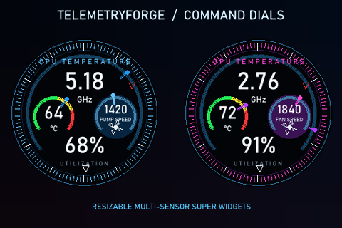

# TelemetryForge

An open-source Windows desktop application for TURZX/Turing Smart Screen
3.5-inch USB displays normally controlled by `UsbMonitor.exe`.

## Highlights

- Visual drag-and-drop editor with live preview
- Reusable YAML screen profiles
- CPU, GPU, RAM, VRAM, disk, network, fan and Windows volume sensors
- Text, bars, circular gauges and historical graphs
- Per-widget fonts, gradients, opacity, glow, shadows and thresholds
- Smooth animations and partial display updates
- Automatic screen rules with fade, slide, dissolve and glitch transitions
- English and Italian user interfaces
- Lightweight weather widgets using cached Open-Meteo current conditions

Weather data attribution: [Open-Meteo.com](https://open-meteo.com/),
[CC BY 4.0](https://creativecommons.org/licenses/by/4.0/).

## Included sample

Import [`samples/msi-forged-core.telemetryforge`](samples/msi-forged-core.telemetryforge)
to use the 480×320 **MSI Forged Core** screen, including its background and
widgets.


Other examples:


## Super Widgets

Super Widgets combine multiple sensors and custom graphics into one movable
and resizable editor object.



Release builds include **CPU Command Dial**, **GPU Command Dial**,
**Reactor Core** and **SDK Hello Dial**. Ready-to-use screen profiles are
installed automatically when missing. Editable profiles and standalone WASM
packages are available in [`samples/superwidgets`](samples/superwidgets).

External components can be created in Rust without rebuilding TelemetryForge.
See the complete [Super Widget SDK guide](sdk/README.md).

## Remote Deck LAN

While TelemetryForge is running, the full editor is also available from a
phone or browser at the LAN address shown in the application header, using
port `8787`. The first MVP supports editing, preview, screens, sensors,
automation and rendering controls. File uploads remain desktop-only.
The server can be enabled or disabled from the desktop security panel.

Username/password protection can be enabled from **Remote Deck security** in
the Windows application. Passwords are stored as Argon2 hashes. Do not expose
port `8787` directly to the Internet; encrypted remote access will be added
separately.

## Quick start

```powershell
cargo run
cargo build --release
```

The release executable is written to `target\release\TelemetryForge.exe`.
Always close `UsbMonitor.exe` before starting TelemetryForge.

Configuration and saved screens are stored in
`%LOCALAPPDATA%\TelemetryForge`, so Windows autostart works independently of
the process working directory.

Windows autostart uses an immediate Task Scheduler logon trigger instead of
the delayed `HKCU\Run` startup queue. TelemetryForge starts minimized in the
tray and begins rendering as soon as the user session is available.

For complete English setup, editor and troubleshooting documentation, see
[README.en.md](README.en.md).

Italian documentation is available in [README.it.md](README.it.md).

The release history and detailed changes are documented in
[CODE_CHANGES.md](CODE_CHANGES.md).

<details>
<summary>Legacy Italian documentation</summary>

Applicazione desktop open source per Windows che controlla i display seriali
TURZX/Turing Smart Screen da 3,5" normalmente gestiti da `UsbMonitor.exe`.

Questa versione è un MVP: invia un frame RGB565 completo, mostra CPU, GPU, RAM
e orologio, offre anteprima live, sfondo configurabile, orientamento,
luminosità, tray e avvio automatico.

## Stato del supporto

- Modello: Turing Smart Screen 3,5", protocollo hardware revision A.
- Rilevamento: seriale `USB35INCHIPSV2` oppure USB VID/PID `1a86:5722`.
- Trasporto: 115200 baud, flow control hardware.
- Frame: RGB565 little-endian, comando bitmap compatibile con
  `turing-smart-screen-python`.
- Risoluzione MVP: 480×320 landscape; 320×480 portrait.

Chiudere sempre `UsbMonitor.exe` prima di avviare TurzxControl: una porta COM
può essere aperta da una sola applicazione.

## Prerequisiti

1. Windows 10/11 con WebView2 Runtime.
2. Rust stable con toolchain Windows MSVC consigliata:
   `rustup default stable-x86_64-pc-windows-msvc`.
3. Driver seriale del display (spesso CH340/CH552).
4. Facoltativo: LibreHardwareMonitor per temperature CPU/GPU.

Non serve Node.js: il frontend è HTML/CSS/JavaScript statico incluso in Tauri.

## Avvio in sviluppo

```powershell
cargo run
```

Il file `config.yaml` viene letto dalla directory di lavoro. Se manca, viene
creato con i valori predefiniti.

## Build release

```powershell
cargo build --release
```

Per creare anche installer/bundle Tauri:

```powershell
cargo install tauri-cli --version "^2"
cargo tauri build
```

L'eseguibile non-bundled si trova in `target\release\TurzxControl.exe`.

## LibreHardwareMonitor

1. Scaricare una release di LibreHardwareMonitor.
2. Avviarlo una volta come amministratore e verificare che mostri i sensori.
3. In `config.yaml`, impostare il percorso assoluto:

```yaml
libre_hardware_monitor_dll: 'C:\Tools\LibreHardwareMonitor\LibreHardwareMonitorLib.dll'
```

TurzxControl usa `scripts\read-lhm.ps1` come bridge. Preferisce PowerShell 7
quando installato e usa Windows PowerShell come fallback. Alcuni sensori
richiedono privilegi amministrativi; se un valore non è disponibile, la UI
mostra `--`. Utilizzo CPU e RAM provengono direttamente da `sysinfo`.

## Configurazione

Ogni widget in `config.yaml` supporta:

- `enabled`
- `x`, `y`, `width`, `height`
- `font_size`
- `colour`
- `refresh_interval_ms`
- `label_format`, con segnaposto `{value}` o `{value:.0}`

Gli sfondi supportano `contain`, `cover`, `stretch` e `centre`.

## Editor screen

- Gli screen possono essere creati, salvati, caricati ed eliminati dalla UI.
- Ogni screen viene salvato come file YAML nella cartella `screens`.
- I widget possono essere trascinati direttamente sulla preview.
- Il menu Widget permette di aggiungere sensori, clock GPU e testo libero.
- Il campo `Testo / formato` accetta testo normale oppure `{value}`, per
  esempio `GPU {value} MHz`.
- Ogni widget ha anche `Testo sinistro` e `Testo destro`, utili per aggiungere
  etichette e unità senza creare widget di testo separati.
- Testo, colori, dimensioni, posizione e font aggiornano la preview in tempo
  reale. Ogni widget può usare un font Windows diverso.
- Da ogni widget è possibile creare una barra o un indicatore circolare
  collegato allo stesso sensore. Gli indicatori sono elementi indipendenti,
  trascinabili e ridimensionabili dalla preview.
- Sono disponibili grafici storici CPU/GPU/rete, gradienti, glow, ombre,
  opacità, soglie cromatiche e screen rapidi Gaming/Minimal/Idle.
- Durante il rendering i valori vengono interpolati e il display riceve solo
  il rettangolo modificato quando è più piccolo di un frame completo.

Il sample dimostrativo **MSI Forged Core** può essere importato dal file
`samples\msi-forged-core.telemetryforge`, ottimizzato per 480×320.

## Risoluzione dei problemi

### Display non trovato

- Chiudere `UsbMonitor.exe` dal tray e dal Task Manager.
- Scollegare e ricollegare il cavo USB dati.
- Controllare in Gestione dispositivi che compaia una porta COM.
- Installare/aggiornare il driver CH340 se necessario.
- Se l'auto-detect non funziona, selezionare manualmente la porta nella UI o
  impostare `display.port: COM3` nel file YAML.
- La casella della porta accetta anche testo libero: è possibile digitare
  direttamente `COM3`, `COM4`, ecc. anche quando la porta non compare
  nell'elenco suggerito.

### Porta COM occupata o accesso negato

Un altro processo ha aperto il dispositivo. Chiudere il software originale,
eventuali terminali seriali e una seconda istanza di TurzxControl.

### Immagine ruotata o distorta

Usare 480×320 con `landscape`, oppure 320×480 con `portrait`. Alcuni cloni
possono usare una revisione di protocollo diversa; questo MVP implementa solo
la revisione A originale.

### Temperature assenti

Verificare il percorso della DLL, provare ad avviare TurzxControl come
amministratore e controllare che LibreHardwareMonitor stesso veda il sensore.

## Origine del protocollo

La codifica dei comandi è stata ricavata dal progetto open source
[`turing-smart-screen-python`](https://github.com/mathoudebine/turing-smart-screen-python),
in particolare dal driver revision A. Il codice Rust qui presente è una nuova
implementazione minimale e non copia asset o codice Python del progetto.

## Licenza

MIT. Vedere [LICENSE](LICENSE).

</details>
